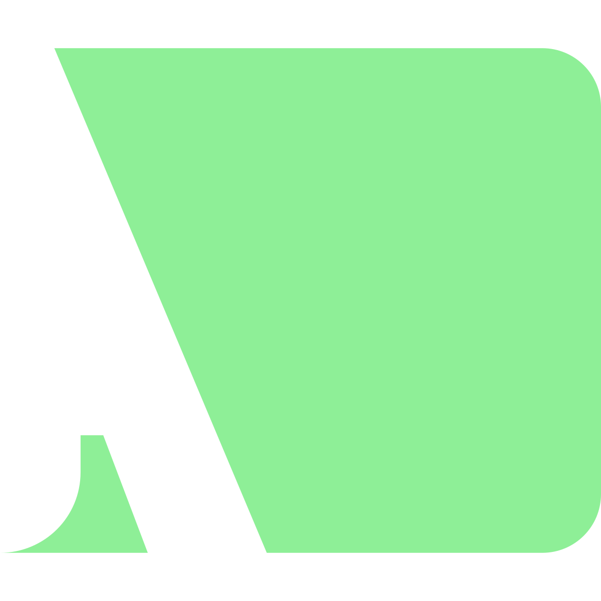

# LineEditAutocomplete
A node for Godot 4 that receives a list of words for which provides autocompletion while writing

## Install
1. Download the repo
2. Copy the `addons` folder in the root of your project
3. From the Godot settings, under `Plugins` check to activate it.
4. The node'll be in the nodes list, searching for "LineEditAutcomplete"